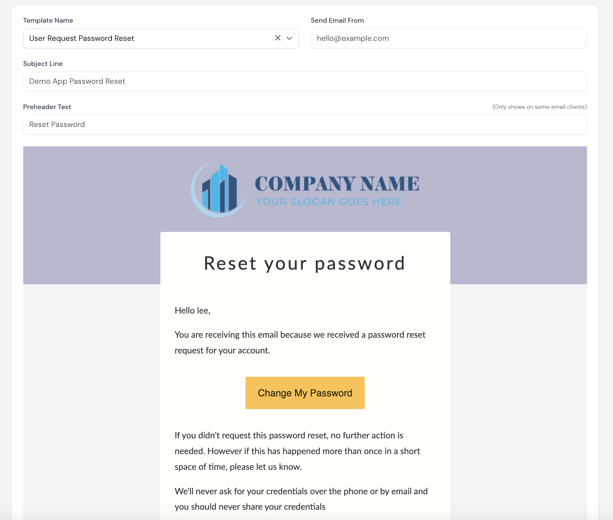

# Email template editor for Filament

[](https://packagist.org/packages/visualbuilder/email-templates)
[](https://packagist.org/packages/visualbuilder/email-templates)


### Why businesses and applications should use Email Templates
- **Time-saving**: Email templates eliminate the need to create emails from scratch, saving valuable time and effort.
- **Customizability**: Quick editing capabilities enable employees to personalize the content of the templates while maintaining a professional appearance.
- **Consistent branding**: Templates ensure that all emails adhere to the brand's guidelines, reinforcing brand recognition and professionalism.
- **Professional appearance**: Well-designed templates provide a polished and consistent look, enhancing the business's credibility and reputation.
- **Streamlined communication**: Prompt and efficient communication.
- **Flexibility**: Templates can be adapted for various purposes, such as promotional emails, customer support responses, newsletters, and more.
- **Easy updates**: Templates can be easily modified to reflect changes in offers, policies, or design elements, ensuring that communication remains current and aligned with business objectives.
- **Standardization**: Templates enforce a standardized structure and format for emails, reducing errors and improving clarity in communication.
- **Scalability**: Email templates facilitate consistent messaging even as the business grows, ensuring a cohesive customer experience across all interactions.
- **Improved productivity**: With quick access to templates, employees can focus more on core tasks, increasing overall productivity within the business.

### This package provides:-
- Content management for email templates allowing authorised users to edit email template content in the admin.
- Templates can include model attribute tokens or config values which will be replaced, eg ##user.name## or ##config.app.name##
- Templates can be saved with different locales for multi-lingual capability.
- A generic method for quickly creating mail classes to speed up adding new templates and faster automation possiblities.

We use the standard Laravel mail sending capability, the package simply allows content editing and faster adding of new templates.



## Installation

Get the package via composer:
```bash
composer require visualbuilder/email-templates
```
Run the install command
```bash
 php artisan filament-email-templates:install
```

## Usage

### HTML Editor
Edit email content in the admin and use tokens to inject model or config content.


Note: The seeder can also be edited directly if you wish to prepopulate with your own content.
`Database\Seeders\EmailTemplateSeeder.php`

### Tokens
Token format is ##model.attribute##.  When calling the email pass any referenced models to replace the tokens automatically.

You can also include config values in the format ##config.file.key## eg ##config.app.name##.  In the email tempalates config file you must whitelist keys that should be allowed.
We shouldn't allow users to include any key which could compromise security.

#### Custom token replacement functions
If necessary the token helper can be extended with your own functions.  Create a file like this:-
```php
namespace App\Helpers;

use Visualbuilder\EmailTemplates\Helpers\TokenHelper;

class CustomTokenHelper extends TokenHelper
{
    public function replaceTokens($string, $models)
    {
        // Call parent method to use the existing functionality.
        $string = parent::replaceTokens($string, $models);

        // Add custom your functionality here.

        return $string;
    }
}
```
and then in your AppServiceProvider override the token helper interface.

```php
use Visualbuilder\EmailTemplates\Contracts\TokenHelperInterface;
use App\Helpers\CustomTokenHelper;

class AppServiceProvider extends ServiceProvider
{
    public function register()
    {
        $this->app->singleton(TokenHelperInterface::class, CustomTokenHelper::class);
    }
}
```

Now when the email template is rendered it will use the built-in token helper and then your custom functions.

### Implementing out of the box templates

Emails may be sent directly, via a notification or an event listener.  

The following email templates are included to get you started and show different methods of sending.

 - **User Registered**  - Welcome them to the platform
 - **User Verify Email** - Check they are human
 - **User Verified Email** - Yes they are
 - **User Request Password Reset** - Let them change the password
 - **User Password Reset Success** - Yay, you changed your password
 - **User Locked Out** - Oops - What to do now?
 - **User Login** - Success

Not all systems will require a login notification,  but it's good practice for security so include here.

#### New User Registered Email
A new **Registered** event is triggered when creating a new user.

It's good practice to welcome the new user to your platform with a friendly email, so we've included a listener for the Illuminate\Auth\Events\Registered Event
and will send the email if enabled in the config.

#### User Verify Email
This notification is built in to Laravel so we have overidden the default toMail function to use our custom email template.

For reference this is done in the `EmailTemplatesAuthServiceProvider`.

This can be disabled in the config.

To Enable email verification ensure the User model implements the Laravel MustVerifyEmail contract:-

```php
class User extends Authenticatable implements MustVerifyEmail
```

and include the **verified** middleware in your routes. 


#### User Request Password Reset
Another Laravel built in notification, but to enable the custom email just add this function to your authenticatable user model.

```php
/**
     * @param $token
     *
     * @return void
     */
    public function sendPasswordResetNotification($token)
    {
        $url = \Illuminate\Support\Facades\URL::secure(route('password.reset', ['token' => $token, 'email' =>$this->email]));

        $this->notify(new \Visualbuilder\EmailTemplates\Notifications\UserResetPasswordRequestNotification($url));
    }
```


### Customising the email template

In the config file ``config/email-templates.php`` logo,colours and messaging can be updated.
```php
   //Default Email Styling
    'logo'             => 'media/email-templates/logo.png',

    //Logo size in pixels -> 200 pixels high is plenty big enough.
    'logo_width'       => '476',
    'logo_height'      => '117',

    //Content Width in Pixels
    'content_width'    => '600',

    //Background Colours
    'header_bg_color'  => '#B8B8D1',
    'body_bg_color'    => '#f4f4f4',
    'content_bg_color' => '#FFFFFB',
    'footer_bg_color'  => '#5B5F97',
    'callout_bg_color' => '#B8B8D1',
    'button_bg_color'  => '#FFC145',

    //Text Colours
    'body_color'       => '#333333',
    'callout_color'    => '#000000',
    'button_color'     => '#2A2A11',
    'anchor_color'     => '#4c05a1',

    //Contact details included in default email templates
    'customer-services-email'=>'support@yourcompany.com',
    'customer-services-phone'=>'+441273 455702',

    //Footer Links
    'links' =>[
        ['name'=>'Website','url'=>'https://yourwebsite.com','title'=>'Goto website'],
        ['name'=>'Privacy Policy','url'=>'https://yourwebsite.com/privacy-policy','title'=>'View Privacy Policy'],
    ],


If you wish to further edit the template see the primary template here:-
`resources/views/vendor/vb-email-templates/email/default.php`

You are free to create a new template in this directory and it will be automatically visible on the email tempalte editor.

```
### Testing

```bash
./vendor/bin/pest      
```

### Changelog

Please see [CHANGELOG](CHANGELOG.md) for more information what has changed recently.

## Contributing

Please see [CONTRIBUTING](CONTRIBUTING.md) for details.

### Security

If you discover any security related issues, please email support@ekouk.com instead of using the issue tracker.

## Credits

-   [Visual Builder](https://github.com/visualbuilder)

## License

The GNU GPLv3. Please see [License File](LICENSE.md) for more information.

